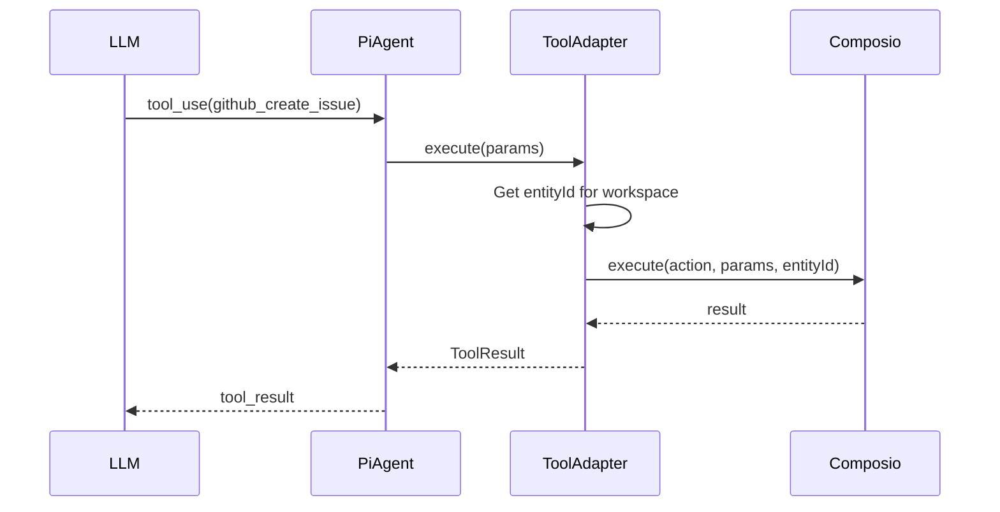

# Tool System Design

## Overview

Replace Composio MCP integration with Pi Agent tool adapters. Convert Composio actions to Pi's `AgentTool` format while maintaining workspace isolation via entity IDs.

## Pi Agent Tool Interface

### AgentTool Type

```typescript
import { Type } from "@mariozechner/pi-ai";
import type { AgentTool } from "@mariozechner/pi-agent-core";

interface AgentTool<TParams = any> {
  name: string; // Tool identifier
  label: string; // Display name
  description: string; // When/how to use this tool
  parameters: TParams; // TypeBox schema
  execute: (
    toolCallId: string,
    params: TParams,
    signal: AbortSignal,
    onUpdate?: (partial: ToolResult) => void,
  ) => Promise<ToolResult>;
}

interface ToolResult {
  content: Array<{ type: "text"; text: string }>;
  details: Record<string, unknown>; // Not sent to LLM, for UI only
}
```

## Composio Tool Adapter

### Module: `apps/server/src/pi/tools/composio-tools.ts`

```typescript
import { Composio } from "@composio/core";
import { Type } from "@mariozechner/pi-ai";
import type { AgentTool } from "@mariozechner/pi-agent-core";

export interface ComposioToolConfig {
  workspaceId: string;
  userId: string;
  composioClient: Composio;
}

/**
 * Build Composio tools for a specific workspace
 */
export async function buildComposioTools(
  config: ComposioToolConfig,
): Promise<AgentTool[]> {
  const { workspaceId, userId, composioClient } = config;

  // Create workspace-specific entity ID for isolation
  const entityId = `ws_${workspaceId}_user_${userId}`;

  // Get connected integrations for this workspace
  const integrations = await getWorkspaceIntegrations(workspaceId);

  const tools: AgentTool[] = [];

  for (const integration of integrations) {
    // Get available actions for this integration
    const actions = await composioClient.actions.list({
      apps: [integration.appName],
    });

    for (const action of actions) {
      tools.push(createComposioTool(action, entityId, composioClient));
    }
  }

  return tools;
}

/**
 * Convert a Composio action to Pi AgentTool
 */
function createComposioTool(
  action: any,
  entityId: string,
  composioClient: Composio,
): AgentTool {
  // Convert Composio schema to TypeBox
  const parameters = convertComposioSchemaToTypeBox(action.parameters);

  return {
    name: action.name,
    label: action.displayName || action.name,
    description: action.description || `Execute ${action.name}`,
    parameters,
    execute: async (toolCallId, params, signal, onUpdate) => {
      try {
        // Execute Composio action with workspace entity ID
        const result = await composioClient.execute({
          action: action.name,
          params,
          entityId, // Workspace isolation
          connectedAccountId: action.connectedAccountId,
        });

        return {
          content: [
            {
              type: "text",
              text: JSON.stringify(result, null, 2),
            },
          ],
          details: {
            action: action.name,
            entityId,
            executionTime: result.executionTime,
          },
        };
      } catch (error) {
        return {
          content: [
            {
              type: "text",
              text: `Error executing ${action.name}: ${error.message}`,
            },
          ],
          details: {
            error: error.message,
            action: action.name,
          },
        };
      }
    },
  };
}

/**
 * Convert Composio JSON Schema to TypeBox
 */
function convertComposioSchemaToTypeBox(composioSchema: any): any {
  if (!composioSchema || !composioSchema.properties) {
    return Type.Object({});
  }

  const typeBoxProps: Record<string, any> = {};

  for (const [key, prop] of Object.entries(composioSchema.properties)) {
    const propSchema = prop as any;

    switch (propSchema.type) {
      case "string":
        typeBoxProps[key] = Type.String({
          description: propSchema.description,
        });
        break;
      case "number":
      case "integer":
        typeBoxProps[key] = Type.Number({
          description: propSchema.description,
        });
        break;
      case "boolean":
        typeBoxProps[key] = Type.Boolean({
          description: propSchema.description,
        });
        break;
      case "array":
        typeBoxProps[key] = Type.Array(Type.Any(), {
          description: propSchema.description,
        });
        break;
      case "object":
        typeBoxProps[key] = Type.Object(
          {},
          {
            description: propSchema.description,
          },
        );
        break;
      default:
        typeBoxProps[key] = Type.Any({
          description: propSchema.description,
        });
    }
  }

  return Type.Object(typeBoxProps);
}

/**
 * Get workspace integrations from database
 */
async function getWorkspaceIntegrations(workspaceId: string) {
  const db = getDb();
  return await db
    .select()
    .from(schema.workspaceIntegrations)
    .where(eq(schema.workspaceIntegrations.workspaceId, workspaceId));
}
```

## Web Tools

### Module: `apps/server/src/pi/tools/web-tools.ts`

```typescript
import { Type } from "@mariozechner/pi-ai";
import type { AgentTool } from "@mariozechner/pi-agent-core";

/**
 * Web Search Tool
 */
export const webSearchTool: AgentTool = {
  name: "web_search",
  label: "Web Search",
  description: "Search the web for information, documentation, or answers",
  parameters: Type.Object({
    query: Type.String({
      description: "Search query",
    }),
    maxResults: Type.Optional(
      Type.Number({
        description: "Maximum number of results",
        default: 5,
      }),
    ),
  }),
  execute: async (toolCallId, params) => {
    try {
      // TODO: Integrate with search API (Brave, Serper, etc.)
      const results = await performWebSearch(params.query, params.maxResults);

      const formattedResults = results
        .map((r, i) => `${i + 1}. ${r.title}\n   ${r.url}\n   ${r.snippet}`)
        .join("\n\n");

      return {
        content: [
          {
            type: "text",
            text: `Search results for "${params.query}":\n\n${formattedResults}`,
          },
        ],
        details: {
          query: params.query,
          resultCount: results.length,
        },
      };
    } catch (error) {
      return {
        content: [
          {
            type: "text",
            text: `Search failed: ${error.message}`,
          },
        ],
        details: { error: error.message },
      };
    }
  },
};

/**
 * Web Fetch Tool
 */
export const webFetchTool: AgentTool = {
  name: "web_fetch",
  label: "Web Fetch",
  description: "Fetch and extract content from a specific URL",
  parameters: Type.Object({
    url: Type.String({
      description: "URL to fetch",
    }),
    selector: Type.Optional(
      Type.String({
        description: "CSS selector to extract specific content",
      }),
    ),
  }),
  execute: async (toolCallId, params) => {
    try {
      const content = await fetchWebContent(params.url, params.selector);

      return {
        content: [
          {
            type: "text",
            text: `Content from ${params.url}:\n\n${content}`,
          },
        ],
        details: {
          url: params.url,
          contentLength: content.length,
        },
      };
    } catch (error) {
      return {
        content: [
          {
            type: "text",
            text: `Failed to fetch ${params.url}: ${error.message}`,
          },
        ],
        details: { error: error.message },
      };
    }
  },
};

// Placeholder implementations
async function performWebSearch(query: string, maxResults: number = 5) {
  // TODO: Implement with actual search API
  return [];
}

async function fetchWebContent(url: string, selector?: string) {
  // TODO: Implement with actual fetch + parsing
  return "";
}
```

## Built-in Pi Tools

Pi Agent provides these tools out of the box:

```typescript
import {
  codingTools, // [read, bash, edit, write]
  readOnlyTools, // [read, grep, find, ls]
  allBuiltInTools, // All individual tools
} from "@mariozechner/pi-coding-agent";

// Use default coding tools
const tools = codingTools;

// Or select specific tools
const tools = [
  allBuiltInTools.read,
  allBuiltInTools.write,
  allBuiltInTools.bash,
  allBuiltInTools.grep,
];
```

### Built-in Tool Descriptions

| Tool    | Description                                                                                                 |
| ------- | ----------------------------------------------------------------------------------------------------------- |
| `read`  | Read file contents and images (jpg, png, gif, webp). Truncated to 2000 lines or 50KB.                       |
| `write` | Write content to a file. Creates if doesn't exist, overwrites if does. Auto-creates parent directories.     |
| `edit`  | Replace exact text in a file. oldText must match exactly (including whitespace).                            |
| `bash`  | Execute a shell command. Returns stdout and stderr, truncated to last 2000 lines or 50KB.                   |
| `grep`  | Search file contents for regex or literal pattern. Returns matching lines with file paths and line numbers. |
| `find`  | Search for files by glob pattern. Returns matching paths relative to search directory.                      |
| `ls`    | List directory contents. Entries sorted alphabetically with / suffix for directories.                       |

## Tool Registry

### Module: `apps/server/src/pi/tools/index.ts`

```typescript
import { codingTools } from "@mariozechner/pi-coding-agent";
import type { AgentTool } from "@mariozechner/pi-agent-core";
import {
  buildComposioTools,
  type ComposioToolConfig,
} from "./composio-tools.js";
import { webSearchTool, webFetchTool } from "./web-tools.js";

/**
 * Build complete tool set for a workspace
 */
export async function buildWorkspaceTools(
  config: ComposioToolConfig,
): Promise<AgentTool[]> {
  // Start with Pi's built-in coding tools
  const tools: AgentTool[] = [...codingTools];

  // Add web tools
  tools.push(webSearchTool, webFetchTool);

  // Add Composio tools for this workspace
  const composioTools = await buildComposioTools(config);
  tools.push(...composioTools);

  return tools;
}

/**
 * Get tool by name
 */
export function getToolByName(
  tools: AgentTool[],
  name: string,
): AgentTool | undefined {
  return tools.find((t) => t.name === name);
}

/**
 * Get tool names for display
 */
export function getToolNames(tools: AgentTool[]): string[] {
  return tools.map((t) => t.name);
}
```

## Workspace Isolation

### Entity ID Pattern

```typescript
// Composio entity ID format for workspace isolation
const entityId = `ws_${workspaceId}_user_${userId}`;

// Examples:
// ws_abc123_user_xyz789
// ws_550e8400-e29b-41d4-a716-446655440000_user_7c9e6679-7425-40de-944b-e07fc1f90ae7
```

### Tool Scoping

```typescript
// When creating agent session for a chat
const tools = await buildWorkspaceTools({
  workspaceId: chat.workspaceId,
  userId: chat.userId,
  composioClient: getComposioClient(),
});

// Tools are now scoped to this workspace
// Composio actions will use ws_{workspaceId}_user_{userId} entity
```

## Tool Execution Flow



## Error Handling

### Tool Execution Errors

```typescript
execute: async (toolCallId, params, signal, onUpdate) => {
  try {
    const result = await composioClient.execute({
      action: action.name,
      params,
      entityId,
    });

    return {
      content: [{ type: "text", text: JSON.stringify(result, null, 2) }],
      details: { success: true },
    };
  } catch (error) {
    // Return error as tool result (LLM can see and handle)
    return {
      content: [
        {
          type: "text",
          text: `Error: ${error.message}\n\nThe action failed. Please check the parameters and try again.`,
        },
      ],
      details: {
        success: false,
        error: error.message,
        errorType: error.constructor.name,
      },
    };
  }
};
```

### Missing Integration

```typescript
async function buildComposioTools(config: ComposioToolConfig) {
  const integrations = await getWorkspaceIntegrations(config.workspaceId);

  if (integrations.length === 0) {
    console.log(
      `[ComposioTools] No integrations for workspace ${config.workspaceId}`,
    );
    return []; // Return empty array, not an error
  }

  // Build tools...
}
```

## Testing Strategy

### Unit Tests

```typescript
describe("Composio Tool Adapter", () => {
  it("should convert Composio action to Pi tool", () => {
    const action = {
      name: "GITHUB_CREATE_ISSUE",
      displayName: "Create GitHub Issue",
      description: "Create a new issue in a repository",
      parameters: {
        type: "object",
        properties: {
          title: { type: "string", description: "Issue title" },
          body: { type: "string", description: "Issue body" },
        },
      },
    };

    const tool = createComposioTool(action, "test-entity", mockComposioClient);

    expect(tool.name).toBe("GITHUB_CREATE_ISSUE");
    expect(tool.label).toBe("Create GitHub Issue");
    expect(tool.parameters).toBeDefined();
  });

  it("should use workspace entity ID", async () => {
    const tools = await buildComposioTools({
      workspaceId: "ws-123",
      userId: "user-456",
      composioClient: mockComposioClient,
    });

    // Execute a tool
    const tool = tools[0];
    await tool.execute(
      "call-1",
      { title: "Test" },
      new AbortController().signal,
    );

    // Verify entity ID was used
    expect(mockComposioClient.execute).toHaveBeenCalledWith(
      expect.objectContaining({
        entityId: "ws_ws-123_user_user-456",
      }),
    );
  });
});
```

### Integration Tests

```typescript
describe("Tool System Integration", () => {
  it("should build complete tool set for workspace", async () => {
    const tools = await buildWorkspaceTools({
      workspaceId: "test-ws",
      userId: "test-user",
      composioClient: getComposioClient(),
    });

    // Should have built-in tools
    expect(tools.find((t) => t.name === "read")).toBeDefined();
    expect(tools.find((t) => t.name === "write")).toBeDefined();

    // Should have web tools
    expect(tools.find((t) => t.name === "web_search")).toBeDefined();
    expect(tools.find((t) => t.name === "web_fetch")).toBeDefined();

    // Should have Composio tools (if integrations exist)
    const composioTools = tools.filter(
      (t) => t.name.startsWith("GITHUB_") || t.name.startsWith("SLACK_"),
    );
    expect(composioTools.length).toBeGreaterThan(0);
  });
});
```

## Performance Considerations

### Tool Loading

- **Lazy loading**: Only load Composio tools when workspace has integrations
- **Caching**: Cache tool definitions per workspace (invalidate on integration changes)
- **Parallel loading**: Load Composio actions in parallel

### Tool Execution

- **Timeout handling**: Use AbortSignal for long-running tools
- **Streaming updates**: Use onUpdate callback for progress reporting
- **Error recovery**: Return errors as tool results, not exceptions

## Migration from Current System

### Current State

```typescript
// MCP servers passed to Claude Agent SDK
mcpServers: {
  composio: {
    type: 'http',
    url: session.mcp.url,
    headers: session.mcp.headers
  }
}
```

### New State

```typescript
// Composio actions as Pi tools
const tools = await buildWorkspaceTools({
  workspaceId,
  userId,
  composioClient,
});

// Passed to Pi Agent
const { session } = await createAgentSession({
  model,
  customTools: tools,
  sessionManager,
});
```

### Key Differences

- **No MCP protocol**: Direct Composio SDK calls
- **Workspace isolation preserved**: Entity ID pattern maintained
- **Tool format unified**: All tools use Pi's AgentTool interface
