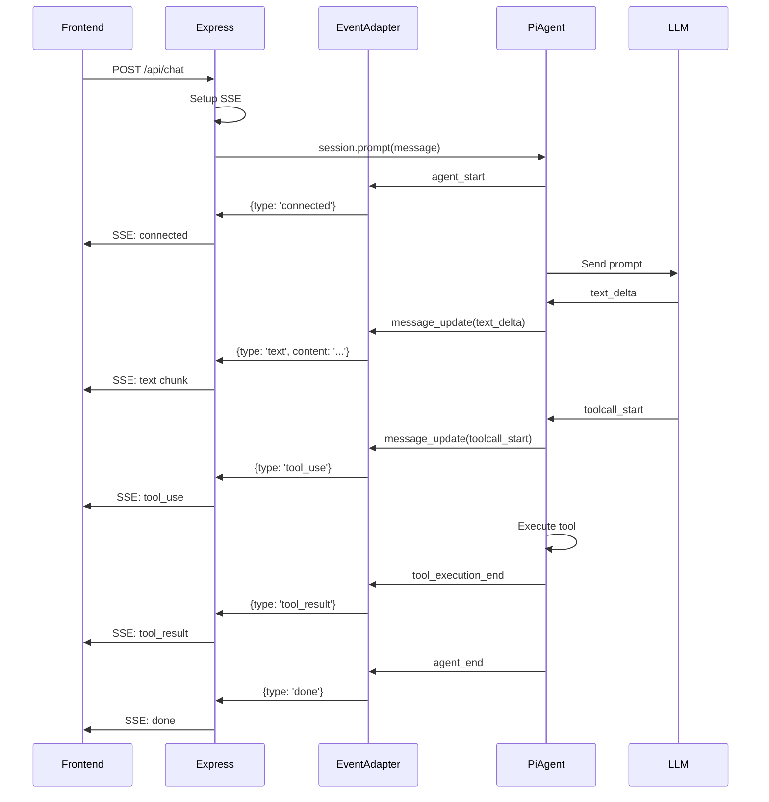

# Event Translation Design

## Overview

Translate Pi Agent events to Normie's StreamChunk SSE format to maintain frontend compatibility. The EventAdapter acts as a bridge between Pi's event system and the existing SSE streaming interface.

## Event Formats

### Pi Agent Events

```typescript
// Pi Agent event types
type PiAgentEvent =
  | { type: "agent_start" }
  | { type: "agent_end" }
  | { type: "turn_start" }
  | { type: "turn_end" }
  | { type: "message_start"; message: AssistantMessage }
  | { type: "message_update"; assistantMessageEvent: MessageEvent }
  | { type: "message_end"; message: AssistantMessage }
  | { type: "tool_execution_start"; toolName: string; args: any }
  | { type: "tool_execution_update"; toolName: string; partial: any }
  | {
      type: "tool_execution_end";
      toolName: string;
      result: any;
      isError: boolean;
    }
  | { type: "auto_compaction_start" }
  | { type: "auto_compaction_end" };

// Message events (nested in message_update)
type MessageEvent =
  | { type: "text_start" }
  | { type: "text_delta"; delta: string }
  | { type: "text_end" }
  | { type: "thinking_start" }
  | { type: "thinking_delta"; delta: string }
  | { type: "thinking_end" }
  | { type: "toolcall_start"; toolCall: ToolCall }
  | { type: "toolcall_delta"; toolCall: ToolCall }
  | { type: "toolcall_end"; toolCall: ToolCall };
```

### Normie StreamChunk Format

```typescript
// Current SSE format used by frontend
type StreamChunk =
  | { type: "connected"; message: string }
  | { type: "session_init"; session_id: string; provider: string }
  | { type: "text"; content: string; provider: string }
  | {
      type: "tool_use";
      name: string;
      input: Record<string, unknown>;
      id: string;
      provider: string;
    }
  | { type: "tool_result"; result: any; tool_use_id: string; provider: string }
  | { type: "done"; provider: string }
  | { type: "error"; message: string; provider?: string }
  | { type: "aborted"; provider: string }
  | { type: "title_update"; title: string };
```

## EventAdapter Module

### Module: `apps/server/src/pi/event-adapter.ts`

```typescript
import type { AgentEvent } from "@mariozechner/pi-agent-core";
import type { StreamChunk } from "@normie/types";

export interface EventAdapterConfig {
  provider: string; // e.g., 'anthropic', 'openai'
  chatId: string;
}

export class EventAdapter {
  private config: EventAdapterConfig;
  private currentToolCalls: Map<string, { name: string; input: any }> =
    new Map();

  constructor(config: EventAdapterConfig) {
    this.config = config;
  }

  /**
   * Translate Pi Agent event to StreamChunk
   */
  translate(event: AgentEvent): StreamChunk | null {
    switch (event.type) {
      case "agent_start":
        return this.handleAgentStart();

      case "message_update":
        return this.handleMessageUpdate(event);

      case "tool_execution_start":
        return this.handleToolStart(event);

      case "tool_execution_end":
        return this.handleToolEnd(event);

      case "agent_end":
        return this.handleAgentEnd();

      case "auto_compaction_start":
      case "auto_compaction_end":
      case "turn_start":
      case "turn_end":
      case "message_start":
      case "message_end":
      case "tool_execution_update":
        // These events don't map to StreamChunk - skip
        return null;

      default:
        console.warn("[EventAdapter] Unknown event type:", (event as any).type);
        return null;
    }
  }

  private handleAgentStart(): StreamChunk {
    return {
      type: "connected",
      message: "Processing request...",
    };
  }

  private handleMessageUpdate(event: any): StreamChunk | null {
    const messageEvent = event.assistantMessageEvent;

    switch (messageEvent.type) {
      case "text_delta":
        return {
          type: "text",
          content: messageEvent.delta,
          provider: this.config.provider,
        };

      case "toolcall_start":
        // Store tool call for later result matching
        const toolCall = messageEvent.toolCall;
        this.currentToolCalls.set(toolCall.id, {
          name: toolCall.name,
          input: toolCall.input,
        });

        return {
          type: "tool_use",
          name: toolCall.name,
          input: toolCall.input,
          id: toolCall.id,
          provider: this.config.provider,
        };

      case "text_start":
      case "text_end":
      case "thinking_start":
      case "thinking_delta":
      case "thinking_end":
      case "toolcall_delta":
      case "toolcall_end":
        // Don't emit separate events for these
        return null;

      default:
        return null;
    }
  }

  private handleToolStart(event: any): StreamChunk | null {
    // Tool start is already handled in toolcall_start
    // This event is for execution tracking
    return null;
  }

  private handleToolEnd(event: any): StreamChunk {
    const toolCall = this.currentToolCalls.get(event.toolCallId);

    return {
      type: "tool_result",
      result: event.result,
      tool_use_id: event.toolCallId,
      provider: this.config.provider,
    };
  }

  private handleAgentEnd(): StreamChunk {
    // Clear tool call tracking
    this.currentToolCalls.clear();

    return {
      type: "done",
      provider: this.config.provider,
    };
  }

  /**
   * Handle errors
   */
  translateError(error: Error): StreamChunk {
    return {
      type: "error",
      message: error.message,
      provider: this.config.provider,
    };
  }

  /**
   * Handle abort
   */
  translateAbort(): StreamChunk {
    return {
      type: "aborted",
      provider: this.config.provider,
    };
  }
}
```

## Integration with Express SSE

### Modified Chat Endpoint

```typescript
app.post("/api/chat", async (req, res) => {
  const { message, chatId, userId, provider, model, workspaceId } = req.body;

  // Setup SSE
  res.setHeader("Content-Type", "text/event-stream");
  res.setHeader("Cache-Control", "no-cache, no-transform");
  res.setHeader("Connection", "keep-alive");
  res.flushHeaders();

  try {
    // Create session manager
    const sessionManager = new NormieSessionManager({
      workspaceId,
      chatId,
    });

    // Build tools
    const tools = await buildWorkspaceTools({
      workspaceId,
      userId,
      composioClient: getComposioClient(),
    });

    // Create Pi Agent session
    const { session } = await createAgentSession({
      model: getModel(provider, model),
      sessionManager: sessionManager.getPiSessionManager(),
      customTools: tools,
      thinkingLevel: "off",
    });

    session.agent.streamFn = streamSimple;

    // Create event adapter
    const eventAdapter = new EventAdapter({
      provider,
      chatId,
    });

    // Subscribe to Pi Agent events
    session.subscribe((event) => {
      const streamChunk = eventAdapter.translate(event);

      if (streamChunk) {
        // Send as SSE
        res.write(`data: ${JSON.stringify(streamChunk)}\n\n`);
      }
    });

    // Execute prompt
    await session.prompt(message);

    res.end();
  } catch (error) {
    const errorChunk = eventAdapter.translateError(error);
    res.write(`data: ${JSON.stringify(errorChunk)}\n\n`);
    res.end();
  }
});
```

## Event Flow Diagram



## Streaming Performance

### Chunk Size Control

Pi Agent's `streamSimple` automatically provides optimal chunk sizes (1-10 characters). No additional buffering needed.

```typescript
// Pi handles chunking internally
for await (const event of streamSimple(model, context)) {
  if (event.type === "text_delta") {
    // event.delta is already optimally sized (1-10 chars)
    res.write(
      `data: ${JSON.stringify({
        type: "text",
        content: event.delta,
        provider,
      })}\n\n`,
    );
  }
}
```

### Latency Optimization

```typescript
// Flush immediately after each chunk
res.write(`data: ${JSON.stringify(chunk)}\n\n`);
// No explicit flush needed - SSE auto-flushes
```

## Error Handling

### Pi Agent Errors

```typescript
session.subscribe((event) => {
  if (event.type === "error") {
    const errorChunk: StreamChunk = {
      type: "error",
      message: event.error.message,
      provider,
    };
    res.write(`data: ${JSON.stringify(errorChunk)}\n\n`);
  }
});
```

### Tool Execution Errors

```typescript
private handleToolEnd(event: any): StreamChunk {
  if (event.isError) {
    return {
      type: 'tool_result',
      result: {
        error: true,
        message: event.result?.message || 'Tool execution failed'
      },
      tool_use_id: event.toolCallId,
      provider: this.config.provider
    };
  }

  return {
    type: 'tool_result',
    result: event.result,
    tool_use_id: event.toolCallId,
    provider: this.config.provider
  };
}
```

### Abort Handling

```typescript
// In Express endpoint
const abortController = new AbortController();

req.on("close", () => {
  abortController.abort();
});

// Pi Agent respects abort signal
session.agent.streamFn = (model, context, options) => {
  return streamSimple(model, context, {
    ...options,
    signal: abortController.signal,
  });
};
```

## Testing Strategy

### Unit Tests

```typescript
describe("EventAdapter", () => {
  it("should translate text_delta to text chunk", () => {
    const adapter = new EventAdapter({
      provider: "anthropic",
      chatId: "test-chat",
    });

    const piEvent = {
      type: "message_update",
      assistantMessageEvent: {
        type: "text_delta",
        delta: "Hello",
      },
    };

    const chunk = adapter.translate(piEvent);

    expect(chunk).toEqual({
      type: "text",
      content: "Hello",
      provider: "anthropic",
    });
  });

  it("should translate toolcall_start to tool_use", () => {
    const adapter = new EventAdapter({
      provider: "anthropic",
      chatId: "test-chat",
    });

    const piEvent = {
      type: "message_update",
      assistantMessageEvent: {
        type: "toolcall_start",
        toolCall: {
          id: "tool-1",
          name: "read",
          input: { path: "file.txt" },
        },
      },
    };

    const chunk = adapter.translate(piEvent);

    expect(chunk).toEqual({
      type: "tool_use",
      name: "read",
      input: { path: "file.txt" },
      id: "tool-1",
      provider: "anthropic",
    });
  });

  it("should return null for non-translatable events", () => {
    const adapter = new EventAdapter({
      provider: "anthropic",
      chatId: "test-chat",
    });

    const piEvent = { type: "turn_start" };
    const chunk = adapter.translate(piEvent);

    expect(chunk).toBeNull();
  });
});
```

### Integration Tests

```typescript
describe("SSE Streaming", () => {
  it("should stream Pi Agent events as SSE", async () => {
    const response = await fetch("http://localhost:3001/api/chat", {
      method: "POST",
      headers: { "Content-Type": "application/json" },
      body: JSON.stringify({
        message: "Hello",
        chatId: "test-chat",
        userId: "test-user",
        provider: "anthropic",
        model: "claude-opus-4-5",
        workspaceId: "test-workspace",
      }),
    });

    const reader = response.body.getReader();
    const decoder = new TextDecoder();

    const chunks: StreamChunk[] = [];

    while (true) {
      const { done, value } = await reader.read();
      if (done) break;

      const text = decoder.decode(value);
      const lines = text.split("\n");

      for (const line of lines) {
        if (line.startsWith("data: ")) {
          const chunk = JSON.parse(line.slice(6));
          chunks.push(chunk);
        }
      }
    }

    // Verify event sequence
    expect(chunks[0].type).toBe("connected");
    expect(chunks.some((c) => c.type === "text")).toBe(true);
    expect(chunks[chunks.length - 1].type).toBe("done");
  });
});
```

## Performance Benchmarks

### Streaming Latency

```typescript
// Measure time between chunks
let lastChunkTime = Date.now();

session.subscribe((event) => {
  const chunk = eventAdapter.translate(event);

  if (chunk && chunk.type === "text") {
    const now = Date.now();
    const latency = now - lastChunkTime;

    console.log(`[Perf] Chunk latency: ${latency}ms`);
    lastChunkTime = now;

    // Target: < 50ms between chunks
    if (latency > 50) {
      console.warn(`[Perf] High latency: ${latency}ms`);
    }
  }
});
```

### First Token Time

```typescript
const startTime = Date.now();
let firstTokenTime: number | null = null;

session.subscribe((event) => {
  if (
    event.type === "message_update" &&
    event.assistantMessageEvent.type === "text_delta" &&
    firstTokenTime === null
  ) {
    firstTokenTime = Date.now() - startTime;
    console.log(`[Perf] First token: ${firstTokenTime}ms`);

    // Target: < 500ms
    if (firstTokenTime > 500) {
      console.warn(`[Perf] Slow first token: ${firstTokenTime}ms`);
    }
  }
});
```

## Frontend Compatibility

### No Changes Required

The frontend continues to consume the same StreamChunk format:

```typescript
// Frontend code (unchanged)
const eventSource = new EventSource("/api/chat");

eventSource.onmessage = (event) => {
  const chunk: StreamChunk = JSON.parse(event.data);

  switch (chunk.type) {
    case "text":
      appendText(chunk.content);
      break;
    case "tool_use":
      showToolCall(chunk.name, chunk.input);
      break;
    case "tool_result":
      showToolResult(chunk.result);
      break;
    case "done":
      finishStream();
      break;
  }
};
```

## Migration Notes

### Current State

- Events come directly from provider (Claude Agent SDK, Opencode, etc.)
- Each provider has custom event format
- Manual normalization in provider classes

### New State

- Events come from Pi Agent (unified format)
- EventAdapter translates to StreamChunk
- Single translation layer for all providers

### Key Benefit

- **One translation layer** instead of N provider-specific normalizations
- **Easier to add providers** - Pi handles provider differences
- **Consistent streaming** - Pi optimizes chunk sizes automatically
